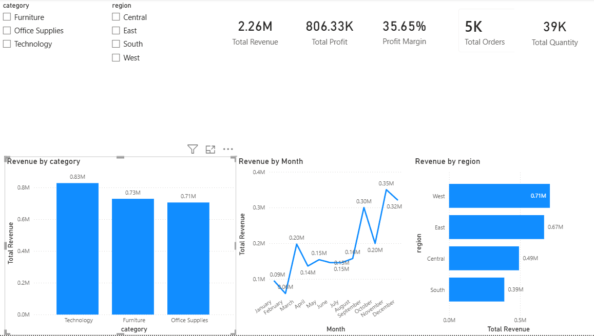

# Supermarket Sales Analytics Dashboard

## Overview
This project analyses supermarket sales data to identify revenue trends, profitability patterns, and regional performance. The goal was to build an end-to-end analytics project using Python for data preparation, exploratory data analysis for insights, and Power BI for dashboard development.

## Business Objective
The project was designed to answer key business questions such as:
- Which product categories generate the most revenue?
- How does revenue change over time?
- Which regions perform best?
- How can interactive filters improve business reporting?

## Tools Used
- Python
- Pandas
- NumPy
- Matplotlib
- Power BI
- GitHub

## Project Workflow
1. Cleaned and prepared raw sales data using Python
2. Engineered additional business features such as estimated cost, profit margin, and customer/order metrics
3. Performed exploratory data analysis to identify trends and patterns
4. Built an interactive Power BI dashboard with KPIs and filters

## Dashboard Features
- KPI cards for Revenue, Profit, Orders, Quantity, and Profit Margin
- Revenue by Category
- Monthly Revenue Trend
- Revenue by Region
- Interactive slicers for Category and Region

## Dashboard Preview


## Key Insights
- Technology generated the highest revenue among categories
- Revenue showed fluctuations across months, suggesting seasonality
- Regional sales performance varied significantly, with some regions outperforming others
- Interactive filters allow focused analysis by category and region

## Repository Structure
```text
project1/
├── data/
├── notebooks/
├── dashboard/
├── images/
├── README.md
└── requirements.txt